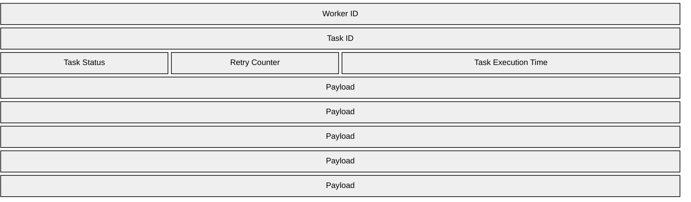
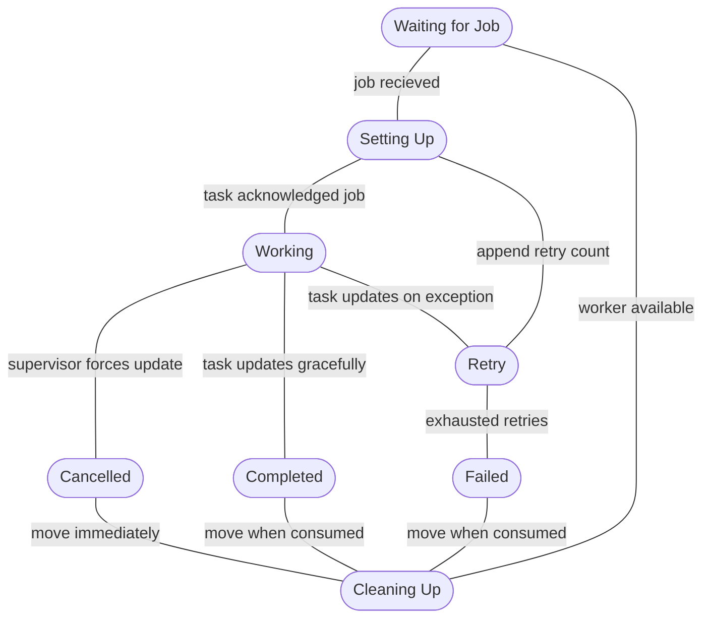

# Bow Task Runner
Similar in idea as _Celery_ in that its aim is to run tasks in parallel, with preemptive instead of cooperative scheduling. Workers have two threads that use cooperative scheduling, where one thread is checking the state of the job to make sure it's not cancelled. The name comes from its use of _Apache Arrow_, as it sets up tasks utilizing shared memory so that the system can be used across languages with no performance penalty. The core is a mechanism for which to supervise and orchestrate tasks. Tasks themselves receive details about their execution state either by updating it their selves or from the supervisor.

The actual byte widths of fields are not yet known, don't assume this layout translates to memory/network.

The _payload_ contains information that is specific to the job to be run, like details about how to find and pull the data it needs for the job. It is a set fixed size for each.
There are several states a _task_ can be in:
- waiting: the task is open to accept work
- pending: the task has been given a job and setting up its resources and moves the the _running_ state
- running: the task is actively working and moves to either _running_, _failed_, or _complete_ states
- cancelled: a task has been cancelled and will be moved to the _cleaning_ state
- retry: a specific state to handle failures and tracks the failure counter, almost identical to _pending_ but will move _cleaning_ when retry count is exceeded
- failed: a task has failed and will go through specified retry stages, exhausted retries will move it to _failed_, while a retry will move it to _pending_
- complete: the task has finished successfully, once the result is consumed it moves into the _cleaning_ state
- cleaning: after a task is finished, cleaning will reset the worker then move it to _waiting_

